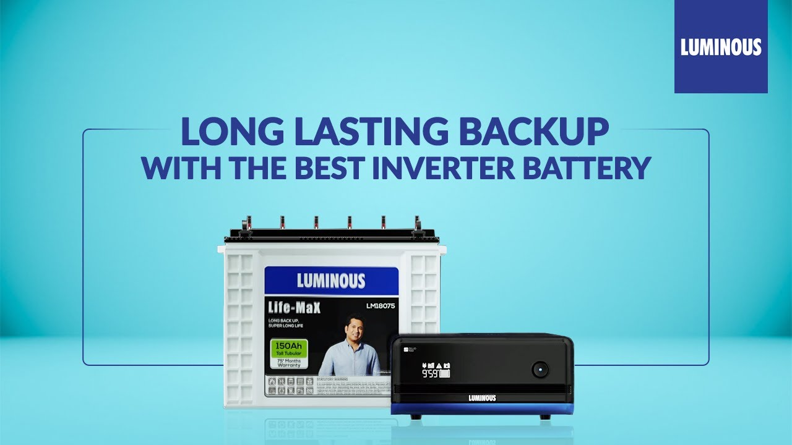

<html>
    <head>
      <title>AmpedUP Supplies</title>
      <link href="https://unpkg.com/tailwindcss@^1.0/dist/tailwind.min.css" rel="stylesheet">
      
    </head>
    <body>
      <header class="header">
        
        <nav class="navbar">
            <a href="#footer1">
          <button class="btn">About</button></a>
          <a href="#contactform">
          <button class="btn">Contact</button></a>
        </nav>
      </header> 
      

        
      
  
       
         
      

       
      <section>
        
Our Product

          
        

          

            
             
            <h1 class="productname">UPS & INVERTER</h1>
             
            <a href="product1.html">
            <button class="btn1">Buy Now</button></a>
          

          

            
             
            <h1 class="productname">BATTERIES</h1>
             
            <a href="product2.html">
            <button class="btn1">Buy Now</button></a>
          

          

            
             
            <h1 class="productname">INVERTER & BATTERY COMBO</h1>
             
            <a href="product3.html">
            <button class="btn1">Buy Now</button></a>
          

          

            
             
            <h1 class="productname">ACCESSORIES</h1>
             
            <a href="product4.html">
            <button class="btn1">Buy Now</button></a>
          

        

          
      </section>
         
      <section>
      

        
        

            <h2 class="text-3xl font-bold mb-8">Contact Us</h2>
            <form action="process_form.php" method="POST" class="grid grid-cols-1 md:grid-cols-2 gap-6">
                <label for="name">Name:</label>
                <input type="text" id="name" name="name" required>

                <label for="email">Email:</label>
                <input type="email" id="email" name="email" required>

                <label for="subject">Subject:</label>
                <input type="text" id="subject" name="subject" required>

                <label for="message">Message:</label>
                <textarea id="message" name="message" rows="4" required></textarea>

                <input type="submit" value="Submit" class="btn2 col-span-2">
            </form>
        

      </section>
        <footer class="footer">
          

              <a href="#">Home</a>
              <a href="#about">About</a>
              <a href="#product">Products</a>
              <a href="#contactform">Contact</a>
          

          

              
Contact us at: +91-92111132444

              
 S-11, Gali No 3, Okhla Phase III, New Delhi, India 
              

          

          
&copy; 2023 AmpedUp Supplies. All rights reserved.

      </footer>
  

    </body>    
</html>
